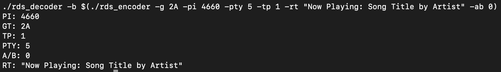
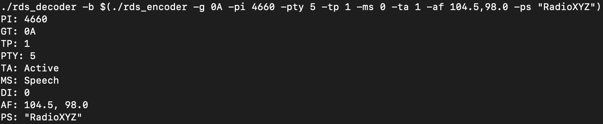

# Radio Data System (RDS) Encoder and Decoder for Group 0A and 2A Message Types

## Course: Wireless and Mobile Networks

## School: Faculty of Information Technology, Brno University of Technology

## Author: Zdeněk Lapeš

## Login: xlapes02

---

## Introduction

The goal of this project is to implement an RDS (Radio Data System) encoder and decoder that can process specific RDS message types—specifically, groups **0A** and **2A**. This project involves:

- Reading command-line arguments,
- Encoding data into binary packets according to RDS standards,
- Validating packets using CRC (Cyclic Redundancy Check),
- Ensuring the decoder correctly interprets and reconstructs data, even with potential packet reordering.

The encoder encodes data into RDS-compliant binary packets, while the decoder decodes these packets back into human-readable information. Additionally, error detection through CRC checks is incorporated to maintain data integrity. This report outlines the design and functionality of each component, including testing.

---

## Encoder

The encoder, implemented in `rds_encoder.cpp`, converts input parameters (e.g., program identifier, traffic program status, program type) into RDS packets. Key operations in the encoder include:

### 1. **Argument Parsing**

Using the `Args` class, the encoder extracts values from command-line arguments, including:

- Group type,
- Alternative frequencies,
- Program service,
- Radio text,
- Traffic announcement details.

The `Args` class validates inputs, ensuring that required arguments are present and correctly formatted, if some arguments are missing or are incorrect, the program will throw an exception, which is caught in the main function, and program will exit with an error message and error code `1`.

### 2. **Packet Assembly**

The `Program` class’s `process_0A` and `process_2A` methods handle packet generation. Each method encodes data into a specific binary format as defined by RDS standards:

- **Block Structure:** Each RDS packet is divided into four blocks (A, B, C, D), each carrying specific types of data, such as program type or alternative frequencies.
- **CRC Calculation:** CRCs for each block are calculated using predefined offset words to ensure data integrity during transmission.

### 3. **Binary Output**

Once assembled, the encoder outputs binary packets as strings. These packets can be saved, transmitted, or used directly by the decoder for validation and testing.

---

## CRC

The CRC implementation in this project is specifically tailored for the RDS standard, using a 10-bit polynomial to ensure data integrity. It computes CRC values for each block (A, B, C, D) and validates received data, while also handling cases where block order may need to be corrected.

### Key Features:

1. **Fast Calculation:**
   - The CRC computation is efficient, using bitwise operations to perform modulo-2 division.
   - It works on a 16-bit message with 10 appended bits for CRC calculation.

2. **Offset Words:**
   - Each block type (A, B, C, D) has a predefined offset word that helps during validation and reordering.

3. **Error Detection:**
   - The calculated CRC is compared with the received CRC, ensuring that corrupted data is flagged.

#### Code:

```cpp
std::bitset<10> calculate_crc(const std::bitset<16> &message, std::bitset<10> offset) {
   uint32_t data = message.to_ulong();  // Convert message to an integer
   data <<= 10;  // Append 10 zero bits for CRC calculation

   // Perform bitwise operations for modulo-2 division using the CRC polynomial
   for (int i = 25; i >= 10; --i) {
      if (data & (1 << i)) {
         data ^= (CRC_POLYNOMIAL << (i - 10));  // XOR with the shifted polynomial
      }
   }

   // Return the 10-bit remainder XORed with the offset word
   return std::bitset<10>(data & 0x3FF) ^ offset;
}

const auto OFFSET_WORDS = std::map<std::string, std::bitset<CRC_BITS>>{
   {"A", std::bitset<CRC_BITS>(0b0011111100)},
   {"B", std::bitset<CRC_BITS>(0b0110011000)},
   {"C", std::bitset<CRC_BITS>(0b0101101000)},
   {"D", std::bitset<CRC_BITS>(0b0110110100)},
};
```

---

## Decoder

The decoder, implemented in `rds_decoder.cpp`, reconstructs RDS packets back into readable information. Its main features include:

### 1. **Binary Packet Parsing**

The decoder reads binary input, dividing it into blocks (A, B, C, D). Using bit manipulation, the data within each block is extracted.

### 2. **CRC Validation**

The `_check_crc_and_fix_block_order` method is a critical component of the decoder's error-checking mechanism. It ensures the integrity of received data blocks by validating their CRC (Cyclic Redundancy Check) values against expected offsets. Additionally, it reorders the blocks if they are received out of sequence.

#### Step-by-Step Process:

1. **Iterate Over Received Blocks:**  
   Each block in the vector of `blocks` is processed individually. A temporary copy (`tmp_block`) of the block is created to safely evaluate CRC values without directly modifying the original block.

2. **Define Rows for Validation:**  
   The method defines a list of rows (A, B, C, D) from the block, pairing their data (`data_A`, `data_B`, etc.) with their respective CRCs (`crc_A`, `crc_B`, etc.) for validation.

3. **Validate CRC Against Offset Words:**  
   For each offset word in the `OFFSET_WORDS` map, the method calculates the CRC for each row's data. If the calculated CRC matches the expected CRC for a specific offset word:
   - The corresponding block's row is updated with the validated data and CRC.
   - The method records the offset key as a valid match.
   - Processing for that block continues.

4. **Handle Validation Failures:**
   - If no matching CRC is found for a block after evaluating all rows and offsets, an exception is thrown, indicating corruption in the block's data.
   - If the same offset key is used multiple times (indicating non-unique offsets), another exception is raised.

5. **Reordering Blocks:**  
   The method effectively "fixes" the order of rows in the block by associating each row's data with its correct offset based on the validated CRC.

#### Key Code:

```cpp
bool _check_crc_and_fix_block_order(std::vector<Block> &blocks) {
    for (auto &block : blocks) {
        auto tmp_block = block.copy();
        std::set<std::string> founded_offsets;
        bool found = false;

        // Iterate through offset words
        for (const auto &[offset_key, offset_value] : OFFSET_WORDS) {
            auto rows = std::vector<std::tuple<std::string, 
                                    std::reference_wrapper<std::bitset<DATA_BITS>>, 
                                    std::reference_wrapper<std::bitset<CRC_BITS>>>>{
                {"A", std::ref(tmp_block.data_A), std::ref(tmp_block.crc_A)},
                {"B", std::ref(tmp_block.data_B), std::ref(tmp_block.crc_B)},
                {"C", std::ref(tmp_block.data_C), std::ref(tmp_block.crc_C)},
                {"D", std::ref(tmp_block.data_D), std::ref(tmp_block.crc_D)}
            };

            // Validate CRC for each row
            for (const auto &row : rows) {
                const std::string &row_key = std::get<0>(row);
                const std::bitset<DATA_BITS> &row_data = std::get<1>(row);
                const std::bitset<CRC_BITS> &row_crc = std::get<2>(row);

                const auto calculated_crc = calculate_crc(row_data, offset_value);
                if (calculated_crc == row_crc) {
                    if (offset_key == "A") {
                        block.data_A = row_data;
                        block.crc_A = row_crc;
                    } else if (offset_key == "B") {
                        block.data_B = row_data;
                        block.crc_B = row_crc;
                    } else if (offset_key == "C") {
                        block.data_C = row_data;
                        block.crc_C = row_crc;
                    } else if (offset_key == "D") {
                        block.data_D = row_data;
                        block.crc_D = row_crc;
                    } else {
                        throw std::invalid_argument("Invalid offset key: " + offset_key);
                    }
                    founded_offsets.insert(offset_key);
                    found = true;
                    break;
                }
            }
        }

        if (!found) {
            throw std::invalid_argument("CRC check failed - data is corrupted.");
        }

        // Ensure all offsets are unique
        if (founded_offsets.size() != OFFSET_WORDS.size()) {
            throw std::invalid_argument("Bad data - not all offsets are unique.");
        }
    }
}
```


### 3. **Data Reconstruction**

The decoder interprets data based on the group type:

- **Group 0A:** Extracts and displays program identifier (PI), program type (PTY), traffic program (TP), alternative frequencies (AF) and program service (PS), according to this project task.
- **Group 2A:** Extracts and displays radio text (RT) with other relevant flags according to this project task.

---

## Testing

### Testing Approach

Testing was conducted manually using command-line inputs and outputs to validate the functionality of both the encoder and decoder.

### Procedure

1. **Command Execution:**
    - Encode input parameters using the encoder.
    - Feed the resulting binary packets into the decoder.

2. **Validation:**
    - Compare decoded outputs with expected results for program identifiers, traffic programs, program types, alternative frequencies, and radio text.

### Examples

1. **Testing Group 2A:**  
   **Command:**

```bash
./rds_decoder -b \
    $(./rds_encoder -g 2A -pi 4660 -pty 5 -tp 1 -rt "Now Playing: Song Title by Artist" -ab 0)
 ```


2. **Testing Group 0A:**  
**Command:**

```bash
./rds_decoder -b \
    $(./rds_encoder -g 0A -pi 4660 -pty 5 -tp 1 -ms 0 -ta 1 -af 104.5,98.0 -ps "RadioXYZ")
 ```




---

## Conclusion and Challenges

### Conclusion

This project successfully implements an RDS encoder and decoder for groups 0A and 2A, adhering to RDS standards. The encoder accurately converts input parameters into binary packets, while the decoder reconstructs these packets into human-readable information, even handling out-of-order blocks.

Testing confirmed the system's ability to:
- Correctly process valid packets.
- Detect and reject corrupted packets using CRC validation.
- Maintain RDS compliance in encoding and decoding operations.

### Challenges

1. **Strict Formatting Requirements:**  
   Implementing the RDS structure required precise bitwise operations and strict adherence to formatting rules, especially for multi-character data like radio text.

2. **Block Reordering:**  
   Ensuring the decoder could handle out-of-order blocks was complex, requiring robust CRC and offset word validation mechanisms.

3. **Error Detection:**  
   Identifying corrupted packets without affecting valid ones was challenging due to the binary nature of the data.

4. **Manual Testing:**  
   Testing manually with command-line inputs was time-intensive, particularly for edge cases involving corrupted or unordered packets.

5. **Padding and String Manipulation:**  
   Properly padding strings like radio text to meet RDS length requirements required meticulous handling.
